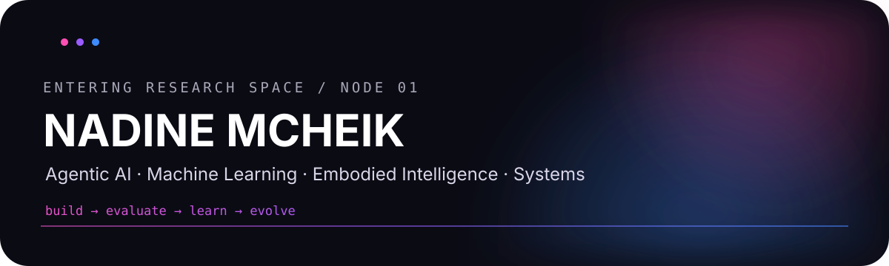
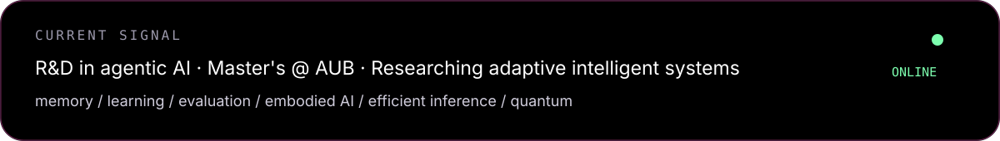

<p align="center">
  
</p>

<p align="center">
  <a href="https://www.linkedin.com/in/nadine-mcheik">
    
  </a>
  <a href="mailto:nnm30@mail.aub.edu">
    
  </a>
  <a href="https://github.com/nadineMck">
    
  </a>
</p>

<p align="center">
  
</p>

<table>
<tr>
<td width="46%" align="center" valign="top">


</td>
<td width="54%" valign="top">

### `about.me`

I'm **Nadine Mcheik**, a Computer Science & Engineering graduate from the **American University of Beirut**, currently pursuing a master's degree while working in **R&D on agentic AI systems**.

I like problems where intelligent systems need to do more than produce one good answer: **remember, adapt, coordinate, evaluate themselves, and improve over time**.

My current research orbit sits around:

`agentic AI` · `self-evolving systems` · `embodied AI`  
`machine learning` · `efficient inference` · `algorithms` · `quantum`

I am especially interested in turning ambitious research questions into systems that can actually be built, tested, and broken.

</td>
</tr>
</table>

<p align="center">
  
</p>

## 01 / research universe

```text
                    ┌──────────────┐
                    │  AGENTIC AI  │
                    └──────┬───────┘
                           │
            ┌──────────────┼──────────────┐
            │              │              │
      ┌─────▼─────┐  ┌────▼────┐   ┌────▼─────┐
      │  MEMORY   │  │ LEARNING │   │ EVALUATION│
      └─────┬─────┘  └────┬────┘   └────┬─────┘
            │              │              │
            └──────────────┼──────────────┘
                           │
                    ┌──────▼───────┐
                    │  EMBODIED AI │
                    └──────────────┘
```

I am currently most interested in systems that **learn from experience without blindly learning from everything**, preserve useful behavior, and improve through evidence rather than intuition.

**Questions I keep coming back to:**
- When should an agent update itself — and when should it refuse to learn?
- How do we evaluate whether a persistent update actually caused improvement?
- How should agents manage memory, tools, permissions, privacy, and feedback over long horizons?
- How do these ideas transfer from language agents to embodied systems and robot learning?
- How can we make intelligent systems faster and more efficient without sacrificing reliability?

<p align="center">
  
</p>

## 02 / what I work on

### 🧠 Agentic AI R&D


My work focuses on how intelligent agents **learn, remember, adapt, and improve over time:**.

- **persistent and self-evolving agents**
- **memory and long-horizon reasoning**
- **learning from feedback and experience**
- **safe tool use and controllable autonomy**
- **evaluation of agent updates**
- **efficient hybrid AI systems**

The part I enjoy most is the boundary between **research idea** and **working system**: defining the failure mode, designing the mechanism, building the experiment, and deciding whether the change actually helped.

---

### ⚛️ Quantum + algorithms

My earlier research path was heavily shaped by **theory, algorithms, and quantum computing**.

I worked across quantum communication/security and machine learning, and my final-year project involved a **photonic quantum random number generator**.

I also founded and served as president of the **AUB Quantum Club**, creating a community around quantum computing and research.

---

### ⚙️ CERN / high-performance computing

I worked on research connected to **CERN's Patatrack ecosystem**, exploring a Mojo port and studying performance, software efficiency, and compilation tradeoffs.

That experience pushed me toward the systems side of AI: not only *what* an algorithm does, but how efficiently and reliably we can make it run.

<p align="center">
  
</p>

## 03 / selected experiments

<table>
<tr>
<td width="50%" valign="top">

### 🌍 FlutterForecast

**Satellite intelligence for locust forecasting**

A geospatial ML platform designed for NGOs and farmers, combining satellite imagery, forecasting, and machine learning.

`geospatial ML` `satellite imagery` `forecasting`

**Recognition**
- 🥇 NASA Space Apps Beirut — 1st place & Global Nominee
- 🥇 Amazon Industry Program — 1st place

</td>
<td width="50%" valign="top">

### 🧪 TestSuite

**AI-assisted software testing**

A tool for generating unit tests and documentation while reasoning about function coverage and software behavior.

`LLMs` `software engineering` `testing`

**Recognition**
- 🥇 42 Beirut × Blackbox.ai Hackathon — 1st place

</td>
</tr>

<tr>
<td width="50%" valign="top">

### 🎵 Feel-The-Flow

**Dynamic sound from motion**

Transforms accelerometer and gyroscope signals into musical structure — melody, rhythm, chords, and intensity.

`sensors` `signal processing` `generative systems`

</td>
<td width="50%" valign="top">

### 🔐 ProxyPro

**Secure proxy infrastructure**

Built a proxy server with authentication, caching, networking optimizations, and a web application firewall.

`Python` `Flask` `TCP/IP` `security`

</td>
</tr>
</table>

<p align="center">
  
</p>

## 04 / system stack

Instead of a wall of logos, this is how I actually think about my toolkit:

| Layer | Tools / areas |
|---|---|
| **Intelligence** | PyTorch · Transformers · RL · representation learning |
| **Agents** | memory · tools · evaluation · feedback learning · orchestration |
| **Systems** | Python · C++ · high-performance computing · APIs |
| **Scientific computing** | NumPy · Pandas · scikit-learn · numerical methods |
| **Research** | experimentation · benchmarking · ablations · literature review |
| **Infrastructure** | Git · Docker · Azure / AWS · Linux |
| **Foundations** | algorithms · probability · optimization · information theory · quantum |

<p align="center">
  
</p>

## 05 / a few coordinates

- 🌟 Ranked **#1 in Lebanon** in the Lebanese Baccalaureate
- 🎓 AUB Computer Science & Engineering graduate
- 📚 Minor in Mathematics; strong focus on Theory & Algorithms
- 🏅 Dean's Honor List
- 💻 Research experience with CERN
- ⚛️ Founder & President, AUB Quantum Club
- 🥇 Multiple hackathon and innovation awards
- 🔬 Currently pursuing graduate research at AUB

<p align="center">
  
</p>

## 06 / now

```text
status:      building
mode:        research + engineering
curiosity:   very much online
```

Current themes:

**self-evolving agents** → learning what to keep, reject, or revise  
**embodied intelligence** → bringing adaptive learning into physical systems  
**efficient inference** → making powerful models cheaper and faster  
**evaluation** → proving that an update helped rather than merely changed behavior

<p align="center">
  
</p>

## 07 / connect

<p align="center">
  <b>If you're working on agents, embodied AI, ML systems, or research that is slightly too ambitious, I probably want to hear about it.</b>
</p>

<p align="center">
  <a href="https://www.linkedin.com/in/nadine-mcheik">
    
  </a>
  <a href="mailto:nnm30@mail.aub.edu">
    
  </a>
</p>

<p align="center">
  <sub>Beirut · papers · code · too many open tabs</sub>
</p>
