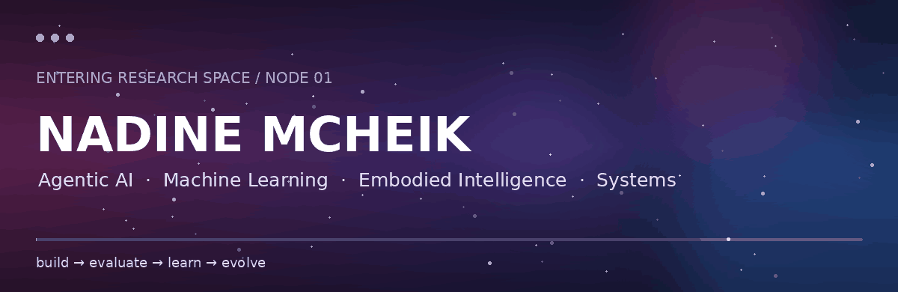
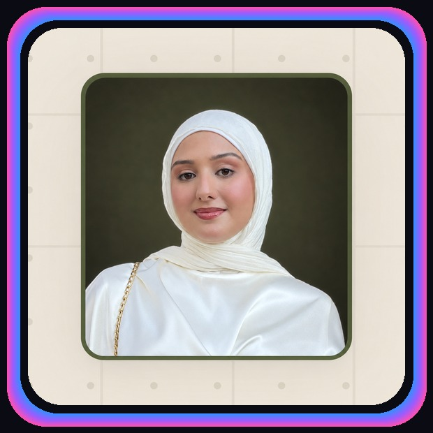
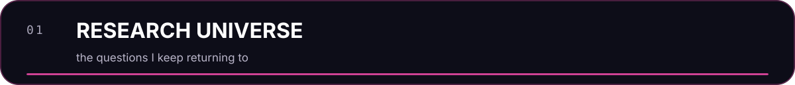
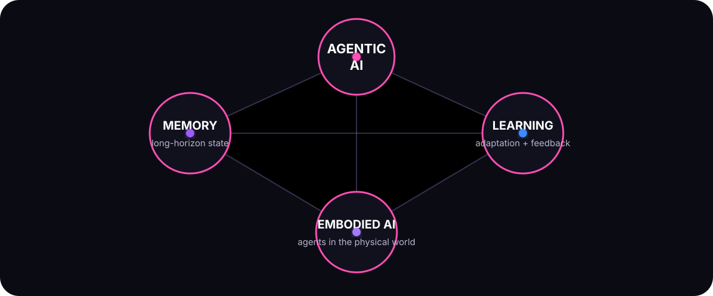
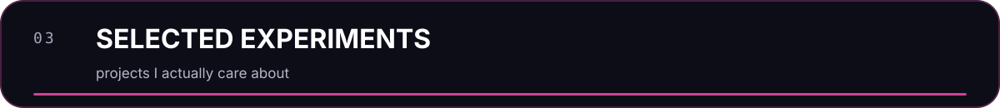
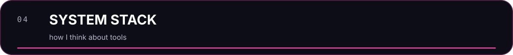
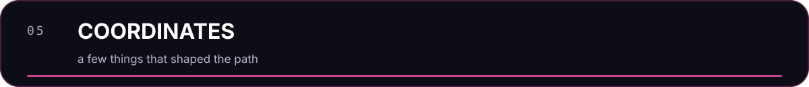
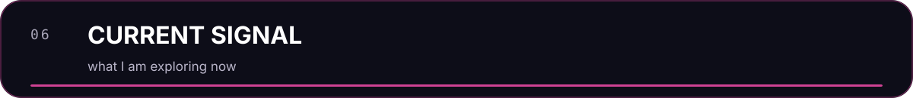

<p align="center">
  
</p>

<p align="center">
  
</p>

<p align="center">
  <a href="https://www.linkedin.com/in/nadine-mcheik"></a>
  <a href="mailto:nnm30@mail.aub.edu"></a>
  <a href="https://github.com/nadineMck"></a>
</p>

<table>
<tr>
<td width="44%" align="center" valign="middle">

</td>
<td width="56%" valign="middle">

### `nadine@research:~$ whoami`

I'm **Nadine Mcheik** — a Computer Science & Engineering graduate from the **American University of Beirut**, currently pursuing a master's degree while working in **R&D on agentic AI systems**.

I like systems that have to do more than answer once.

I care about agents that can **remember, adapt, use tools, learn from feedback, evaluate their own updates, and get better without quietly breaking everything else**.

`agentic AI` · `machine learning` · `embodied intelligence`  
`efficient inference` · `algorithms` · `quantum`

</td>
</tr>
</table>

<p align="center">
  
</p>

<p align="center">
  
</p>

I am especially interested in systems that **learn from experience without blindly learning from everything**.

> **What should an agent remember?**  
> **When should it update itself?**  
> **How do we prove that an update actually helped?**  
> **How do these ideas survive when the agent moves from language into the physical world?**

<p align="center">
  
</p>

My work focuses on how intelligent agents **learn, remember, adapt, and improve over time**.

I am especially interested in:

- **persistent and self-evolving agents**
- **memory and long-horizon reasoning**
- **learning from feedback and experience**
- **safe tool use and controllable autonomy**
- **evaluation of agent updates**
- **efficient hybrid AI systems**

<details>
<summary><b>→ the systems side</b></summary>
<br/>

I also work on the infrastructure that makes those questions real: model orchestration, privacy-aware execution, tool permissions, evaluation loops, feedback pipelines, and the machinery needed to test whether an agent is genuinely getting better.

</details>

<p align="center">
  
</p>

<table>
<tr>
<td width="50%" valign="top">

### 🌍 FlutterForecast
**Satellite intelligence for locust forecasting**

A geospatial ML platform for NGOs and farmers combining satellite imagery, forecasting, and machine learning.

`geospatial ML` `satellite imagery` `forecasting`

**🥇 NASA Space Apps Beirut — 1st + Global Nominee**  
**🥇 Amazon Industry Program — 1st**

</td>
<td width="50%" valign="top">

### 🧪 TestSuite
**AI-assisted software testing**

A tool for generating unit tests and documentation while reasoning about function coverage and software behavior.

`LLMs` `software engineering` `testing`

**🥇 42 Beirut × Blackbox.ai — 1st**

</td>
</tr>

<tr>
<td width="50%" valign="top">

### ⚙️ CERN / Patatrack
**High-performance computing + systems**

Worked on a Mojo port within the Patatrack ecosystem, exploring performance, compilation, and software-efficiency tradeoffs.

`C++` `Mojo` `HPC` `systems`

</td>
<td width="50%" valign="top">

### ⚛️ Quantum
**From theory to hardware**

Worked across quantum communication/security and machine learning; built a photonic quantum random number generator as a final-year project.

`quantum` `algorithms` `information theory`

</td>
</tr>
</table>

<p align="center">
  
</p>

| layer | what lives there |
|---|---|
| **intelligence** | PyTorch · Transformers · RL · representation learning |
| **agents** | memory · tools · evaluation · feedback learning · orchestration |
| **systems** | Python · C++ · high-performance computing · APIs |
| **scientific computing** | NumPy · Pandas · scikit-learn · numerical methods |
| **research** | experimentation · benchmarking · ablations · literature review |
| **infrastructure** | Git · Docker · Azure / AWS · Linux |
| **foundations** | algorithms · probability · optimization · information theory · quantum |

<p align="center">
  
</p>

```text
01  ranked #1 in Lebanon — Lebanese Baccalaureate
02  AUB — Computer Science & Engineering
03  minor in Mathematics · Theory & Algorithms focus
04  Dean's Honor List
05  CERN research experience
06  Founder & President — AUB Quantum Club
07  multiple hackathon + innovation awards
08  graduate research @ AUB
```

<p align="center">
  
</p>

```yaml
status: building
mode: research + engineering
signal:
  - self-evolving agents
  - embodied intelligence
  - efficient inference
  - evaluation
  - learning from experience
curiosity: online
```

<p align="center">
  
  
</p>

<p align="center">
  <b>If you're working on agents, embodied AI, ML systems, or research that is slightly too ambitious, I probably want to hear about it.</b>
</p>

<p align="center">
  <a href="https://www.linkedin.com/in/nadine-mcheik"></a>
  <a href="mailto:nnm30@mail.aub.edu"></a>
</p>

<p align="center">
  <sub>Beirut · papers · code · too many open tabs</sub>
</p>
